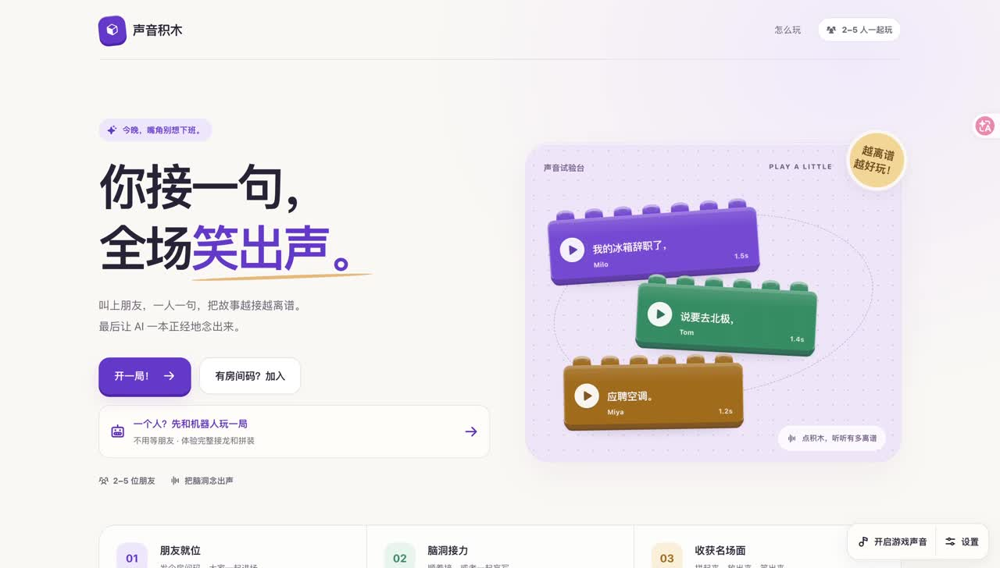

# Voice Bricks · 声音积木

**One sentence each. One shared story. Then hear it out loud.**

[简体中文](README.md) · [Play online](https://web-mu-six-82.vercel.app/) · [Watch the demo](https://x.com/milo_reed/status/2105293980091273331)



Voice Bricks is a story-relay game built with Codex. Each sentence becomes a playable, movable “voice brick.” Arrange the bricks into a story and let a shared voice read it aloud.

Play with friends, or take turns with two AI partners. There are no quiz answers or scores for correctness: the fun is finding out where the next sentence takes the story.

## How to play

1. Choose a theme and voice. Invite friends to a room, or start a solo game.
2. Take turns adding a sentence. In solo mode, you and two AI partners contribute two rounds each, making six bricks.
3. Preview individual bricks, reorder them, and use the final opportunity to revise a sentence.
4. Generate the finished audio, listen to the story, and download a poster to share.

Multiplayer supports 2–5 people: **Classic** lets players read the preceding story; **Chaos** combines sentences written independently.

## Features

- **Solo AI story relay:** DeepSeek receives the full story. One partner moves the plot forward; the other adds a twist. Failed replies can be retried without losing progress.
- **Realtime multiplayer rooms:** room codes, ready states, turns and assembly synchronized through Supabase.
- **Eight Chinese voices:** bundled preview recordings, with custom speech generated through VUI.
- **Story assembly:** individual previews, drag-and-drop reordering, final revision and full playback.
- **Mobile layout and audio feedback:** browser-generated music and interaction sounds, enabled by the player.
- **Sharing:** 1080 × 1350 posters; multiplayer works also offer public work pages and portrait-video export in compatible browsers.

The game UI and voice content are currently in Chinese. This English README documents development; it does not imply an English game interface. Solo progress lives in the current browser session: posters can be downloaded, but solo works do not provide public cross-device work pages or video export.

## Run locally

Requires **Node.js 24** and npm.

```bash
git clone https://github.com/MiloReed/voice-bricks.git
cd voice-bricks/web
npm ci
cp .env.example .env.local
npm run dev
```

Open <http://localhost:3000>. Without credentials, you can browse the UI, play bundled voice previews and visit `/room/demo` for a local sample. **Full solo AI continuation and custom speech generation require the services below.**

### 1. Set up Supabase

Create your own Supabase project and enable **Anonymous Sign-Ins** under Authentication. From the repository root:

```bash
npx supabase login
npx supabase link --workdir backend --project-ref YOUR_PROJECT_REF
npx supabase db push --workdir backend
```

[Supabase CLI reference](https://supabase.com/docs/reference/cli/supabase-db-push)

The CLI applies all 17 migrations from `backend/supabase/migrations/` in order, setting up rooms, bricks, works, storage permissions and shared API rate limits. Target the database created for this project; review migration history before applying them to an existing database.

Add the project URL, publishable key and service-role key to `web/.env.local`. Multiplayer uses anonymous identities and Realtime. **Solo mode does not create a multiplayer room, but its AI and TTS endpoints still use Supabase for shared rate limiting.** DeepSeek and VUI keys alone are insufficient.

For local Supabase, install Docker and run `npx supabase start --workdir backend`. Use the local URL, anonymous key and service-role key printed by the CLI. The local configuration enables anonymous sign-ins and has no seed data.

### 2. Configure DeepSeek and VUI

| Variable | Purpose | Sent to the browser? |
| --- | --- | --- |
| `NEXT_PUBLIC_SUPABASE_URL` | Supabase project URL | Yes |
| `NEXT_PUBLIC_SUPABASE_PUBLISHABLE_KEY` | Public Supabase client key | Yes |
| `SUPABASE_SERVICE_ROLE_KEY` | Server-side storage, authorization and rate limits | No |
| `DEEPSEEK_API_KEY` | AI story continuation and optional commentary | No |
| `DEEPSEEK_MODEL` | Model name; currently defaults to `deepseek-flash` | No |
| `VUILABS_API_KEY` | Speech generation | No |
| `VUILABS_API_BASE_URL` | Defaults to `https://api.vuilabs.cn` | No |

Get keys from your own [DeepSeek](https://platform.deepseek.com/) and [VUI](https://vuilabs.cn/) accounts. You are responsible for enabling those services and their usage costs. See the [VUI API documentation](https://doc.vuilabs.cn/guides/quickstart/). Restart the development server after changing `.env.local`.

The game uses VUI system voices; no voice-model weights are included. A Fish Audio adapter remains for legacy compatibility, but `FISH_API_KEY` is not required by the current game.

## Deploy to Vercel

1. Fork or import this repository and set **Root Directory to `web`**.
2. Set the environment variables above; never upload `.env.local` to GitHub.
3. Apply every migration to your target Supabase project and enable anonymous sign-ins.
4. Set your deployment domain in Supabase Auth's Site URL / Redirect URLs.
5. Test solo continuation, multiplayer rooms, previews, assembly, generation and sharing.

AI and speech endpoints have timeouts and shared quotas. They reject requests when the rate-limit service is unavailable. Bundled previews do not make new TTS calls. Never prefix server secrets with `NEXT_PUBLIC_`.

## Stack and structure

Next.js 16 · React 19 · TypeScript · Tailwind CSS 4 · Motion · dnd-kit · Supabase · DeepSeek · VUI · Remotion

```text
web/
  app/                 Pages and server-side APIs
  features/            Rooms, gameplay, assembly, playback and sharing
  lib/                 Rules, AI, TTS, audio and Supabase
  public/audio/        Bundled homepage and voice-preview recordings
  remotion/            Multiplayer share-video composition
  tests/               Automated tests
backend/supabase/
  migrations/          17 ordered database migrations
```

## Development checks

From `web/`:

```bash
npm test
npm run lint
npm run typecheck
npm run build
```

On a fresh checkout, run `npx next typegen` before the first type check if Next.js route types have not been generated yet. GitHub Actions runs tests, lint, type checking and a build without real provider credentials.

After configuring the services and starting the server, `node scripts/check-http.mjs http://localhost:3000` verifies input validation and the eight bundled previews. `npm run vui:check` calls the real VUI API: it requires a key and consumes quota.

Issues and PRs are welcome. Include your browser and reproduction steps; remove personal data from screenshots and never include keys.

## Scope and license

Original game code is released under the [MIT License](LICENSE). Dependencies retain their own licenses. Provider voices and API services are not licensed by this repository; see [third-party notices](THIRD_PARTY_NOTICES.md).

This repository includes the current Voice Bricks game, database migrations and required sample audio. It excludes local secrets, deployment-account configuration, user data, the retired English module, private recordings and the separate demo-video editing project.
